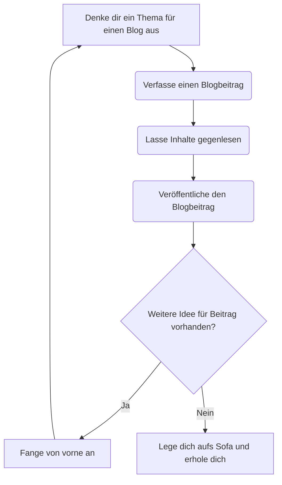

## Einleitung
Zur Visualisierung von Prozessen werden gerne Diagramme verwendet. Besonders beliebt ist die Business Process Modeling Notatation (BPMN) zur Modellierung von Geschäftsprozessen. Sicherlich hast du auch schon einen solchen Prozess im Stil eines Aktivitätsdiagramms gesehen.

Das Erstellen von Diagrammen mit Microsoft Visio, Powerpoint, Gliphy, draw.io oder anderen visuellen Tools ist jedoch aufwändig. Ganz besonders, wenn du viele Abstimmungsrunden durchführen und damit Änderungen einpflegen musst. Am Ende verbringst du mehr Zeit mit der Ausrichtung als den Inhalten. Dafür gibt es eine Lösung: Textbasierte Diagrammerstellung.

## Motivation
Als IT-Projektmanager bin ich mit der Anforderungsaufnahme in Softwareprojekten betraut. Dafür muss ich die Anforderungen und Prozesse des Kunden verstehen. Da allgemein bekannt ist: "Ein Bild sagt mehr als 1000 Worte", bin ich ein großer Freund von Visualisierung.

Ich durfte in der Vergangenheit bereits viele Prozesse visualisieren und habe dies mit verschiedensten Tools gemacht. Am Ende waren alle nervig zu bedienen. Wenn irgendwo ein Zwischenschritt eingefügt werden musste, musste erstmal das ganze Diagramm verschoben und wieder Platz gemacht werden. Hinzu kommt, dass ich ein kleiner Perfektionist bin, was die Ausrichtung angeht. Entsprechend kann ich sehr viel Zeit damit verbringen, ohne einen essentiellen Mehrwert zu schaffen.

Umso glücklicher war ich, als ich erfahren habe, dass es möglich ist, Diagramme mittels Text zu beschreiben und sich anschließend visualieren (der korrekte Begriff hier ist "rendern") zu lassen. Damit ist endlich Schluss mit dem Herumschieben von Kästen und ich kann mich ausschließlich auf die Inhalte fokussieren. Mach' dich bereit für **textbasierte Diagrammerstellung**!

## Textbasierte Diagrammerstellung
Der große Vorteil von textbasierter Diagrammerstellung ist, dass du dich nicht mehr auf die Visualierung des Prozesses, sondern nur noch auf dessen Inhalte konzentrieren musst. Die Diagramme werden durch eine vorgegebene Syntax bzw. Notation mittels möglichst leserlicher Textbausteine beschrieben.

**Generelle Vorteile:**
* Automatische Generierung des Diagramms basierend auf textueller Beschreibung
* Einfache Syntax und Lesbarkeit des Codes
* Revisionierbarkeit von Änderungen
* Fokussierung auf Inhalte
* Vorgebene Notation unterstützt Standardisierung
* Zusammenarbeit durch geteiltes Repository
* Einbindung und direkt Pflege in Sourcecode möglich

### Tools für die Diagrammerstellung
Im wesentlichen gibt es zwei etablierte und kostenlose Tools zur Erstellung textbasierter Diagramme
1. [PlantUML](https://plantuml.com/de/) unter GNU Lizenz
2. [Mermaid](https://mermaid.js.org/intro/getting-started.html) unter MIT Lizenz

Beschreibung von PlantUML:  
> PlantUML is a component that allows you to create various UML diagrams through simple textual descriptions. From sequence diagrams to deployment diagrams and beyond, PlantUML provides an easy way to create visual representations of complex systems.
(Quelle: [Github.com](https://github.com/plantuml/plantuml))

Beschreibung von Mermaid:  
> JavaScript based diagramming and charting tool that renders Markdown-inspired text definitions to create and modify diagrams dynamically.
(Quelle: [mermaid.js.org](https://mermaid.js.org))

### Vergleich der Tools
Welches Tool du einsetzt, bleibt natürlich dir überlassen. Beide machen einen hervorragenden Job. In diesem [Blog-Beitrag von Dan Does Code](https://www.dandoescode.com/blog/plantuml-vs-mermaid) werden die beiden Tools und deren Resultate für unterschiedliche Diagrammtypen verglichen. Vielleicht hilft dir dieser bei der Entscheidungsfindung. Mein aktueller Arbeitgeber hat sich für die Verwendung von PlantUML ausgesprochen und somit verwende ich dieses. Dazu habe ich ein sehenswertes [5-Minuten Video mit einer Vorstellung PlantUML und dessen Vorteilen](https://media.ccc.de/v/chaotikum-plant-uml#) vom Chaos Computer Club gefunden.

### Unterstützte Diagrammarten
Neben dem bereits erwähnten Aktivitätsdiagrammen gibt es zahlreiche weitere Diagrammarten, die unterstützt werden. Welche es im Detail sind, hängt von dem jeweiligen Tool ab. Hier einmal die Diagrammtypen, die von PlantUML und Mermaid unterstützt werden:
* Ablaufdiagramm
* Sequenzdiagramm
* Gantt-Chart
* Klassendiagramm
* Zustandsdiagramm
* Balkendiagramm
* Use Case Diagramm

Darüber hinaus unterstützen die einzelnen Tools weitere Diagrammtypen. Schaut dafür einfach in die jeweilige Dokumentation.

### Notation und Syntax
Zu Beginn ist die Notation gewöhnungsbedürftig, weil du erstmal die Konventionen und Möglichkeiten der Syntax kennenlernen und verinnerlichen musst. Es gibt dankenswerterweise sehr viele **Beispiele**, die du als Ausgangsbasis verwenden kannst.
* [PlantUML Beispiele](https://plantuml.com/de/activity-diagram-beta)
* [Mermaid Beispiele](https://github.com/mermaid-js/mermaid#examples)
Diese kannst du einfach kopieren und abändern.

Zudem ist die **Dokumentation** super!
* [PlantUML Doku](https://plantuml.com/de/)
* [Mermaid Doku](https://github.com/mermaid-js/mermaid#about)

Wenn du dich direkt ausprobieren möchtest, kannst du einen **Online-Editor** nutzen, ohne etwas auf deinem PC installieren zu müssen.
* [PlantUML Online Server](https://www.plantuml.com/plantuml/uml/)
* [Mermaid Live Editor](https://mermaid.live/)

## Editor für textbasierte Diagramme

### Einrichtung
Für die Nutzung eines textbasierten Diagrammeditors empfehle ich dir die Verwendung als Extension in einer IDE (Integrated Development Environment). Ich verwende die [IntelliJ Community Edition von Jetbrains](https://www.jetbrains.com/de-de/idea/download/?section=mac) und [Visual Studio Code von Microsoft](https://code.visualstudio.com/Download) mit den jeweiligen Erweiterungen. Auch hier ist es wieder an dir zu entscheiden, was du verwendest. 

|Tool \ IDE|IntelliJ|VS Code|
|:---|:---:|:---:|
|PlantUML|[Link](https://plugins.jetbrains.com/plugin/7017-plantuml-integration)|[Link](https://marketplace.visualstudio.com/items?itemName=jebbs.plantuml)|
|Mermaid|[Link](https://plugins.jetbrains.com/plugin/20146-mermaid/reviews)|[Link](https://marketplace.visualstudio.com/items?itemName=vstirbu.vscode-mermaid-preview)|


## Diagrammerstellung
Lass dich nicht davon abschrecken, dass du bisher keine IDE benutzt hast. Ja, diese werden eigentlich nur von Entwickler:innen verwendet. Aber am Ende ist dies auch nicht mehr als ein Texteditor mit größerem Funktionsumfang. Der große Vorteil ist, du bekommst eine Vorschau, die dir schon zur Laufzeit ausgibt, was das Ergebnis ist - also während du das Diagramm erstellst bzw. die textuelle Beschreibung formulierst. Hier mal ein Beispiel in VS Code:

{: width="400"}
_Abbildung: Erstellung von PlantUML Diagramm in Visual Studio Code (Quelle: Eigene Darstellung)_

Das von mir eingesetzte Framework Jekyll zur Erstellung meines Blogs erlaubt es mir Mermaid Diagramme direkt einzubinden. Nachfolgend siehst du das entsprechende Mermaid-Pendant des in VS Code erstellten Aktivitätsdiagramms.


_Abbildung: Beispiel für Aktivitätsdiagramm mittels Mermaid (Quelle: Eigene Darstellung)_

Der zugehörige Code zum Mermaid Diagramm sieht folgendermaßen aus:
```
flowchart TD

A[Denke dir ein Thema für einen Blog aus]
A --> B
B(Verfasse einen Blogbeitrag)
B --> C
C(Lasse Inhalte gegenlesen)
C --> D
D(Veröffentliche den Blogbeitrag)
D --> E
E{Weitere Idee für Beitrag vorhanden?}
E -->|Ja| F[Fange von vorne an]
F --> A
E -->|Nein| G[Lege dich aufs Sofa und erhole dich]
```

An dieser Stelle beende ich meine Demo und mein Plädoyer für das Thema. Ich hoffe, ich konnte dir einen Einblick in die Welt der textbasierten Diagrammerstellung geben und dich für das Thema begeistern!

## Zusammenfassung und Fazit
Ich habe dir in diesem Beitrag das Thema textbasierte Diagrammerstellung inklusive dessen Vorteilen nahe gebracht. Darüber hinaus habe ich verschiedene Möglichkeiten aufgezeigt, wie auch du in die Erstellung textbasierter Diagramme einsteigen kannst.

Mein persönliches Fazit: Traue dich und probiere die Diagrammbeschreibung mittels Text einmal aus! Ich bin mir sicher, du wirst sehr schnell überzeugt davon sein. Nach einer kurzen Einarbeitungszeit wird dir das Erstellen neuer und das Anpassen existierenden Diagramme schnell von der Hand gehen. Du wirst damit unglaublich viel Zeit und Nerven in Zukunft sparen!

## Quellen
1. [PlantUML: Offizielle Website](https://plantuml.com/de/)
2. [Mermaid: Offizielle Website](https://mermaid.js.org)
3. [Github: Mermaid Projekt](https://github.com/mermaid-js/mermaid)
4. [Github: PlantUML Projekt](https://github.com/plantuml/plantuml)
5. [Dan Does Code: Vergleich von Mermaid und PlantUML](https://www.dandoescode.com/blog/plantuml-vs-mermaid)
6. [Chaos Computer Club: 5-Minuten Vorstellung von PlantUML](https://media.ccc.de/v/chaotikum-plant-uml#)

**Bildverweise:**  
1. [Github.com: Mermaid Projekt - Header](https://github.com/mermaid-js/mermaid/raw/develop/img/header.png)